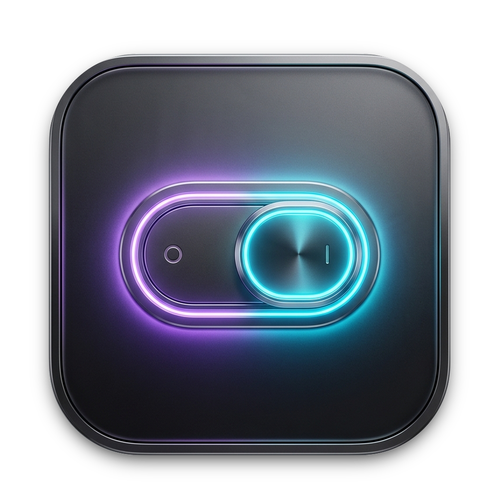

<p align="center">
  
</p>

<h1 align="center">Switch for macOS</h1>

<p align="center">
  <b>The all-in-one native menu bar control center for macOS.</b><br>
  24+ essential toggles, productivity superpowers, smart automations, and fun utilities in one lightweight menu bar app.
</p>

<p align="center">
  <a href="https://github.com/ikingarmaan/Switch/releases/latest"></a>
  
  
  
  
</p>

---

## ⚡️ Instant 1-Click Install on macOS

### Option 1: One-Line Terminal Command (Fastest)

Open Terminal and paste this single command:

```bash
curl -fsSL https://raw.githubusercontent.com/ikingarmaan/Switch/main/install.sh | bash
```

> **What this does**: Automatically downloads the latest verified `Switch.app` release, installs it into your `/Applications` folder, authorizes it, and launches it immediately.

---

### Option 2: Direct Download

Download the pre-compiled, codesigned app bundle directly from GitHub Releases:

- 📦 **[Download Switch.dmg (Disk Image)](https://github.com/ikingarmaan/Switch/releases/latest/download/Switch.dmg)**
- 🗜️ **[Download Switch.zip (Direct App)](https://github.com/ikingarmaan/Switch/releases/latest/download/Switch.zip)**

1. Open the downloaded file.
2. Drag **Switch.app** to your **Applications** folder.
3. Launch **Switch** from Applications or Spotlight (`⌘ Space` -> "Switch").

---

## 🌟 Highlights & Superpowers

| Feature | Description |
| :--- | :--- |
| 🔨 **Chassis Knock Screenshot** | **Double-knock** your MacBook's body or desk to instantly snap a screenshot! Multi-tier audio resonance detection with Ultra, High, and Normal sensitivity modes. |
| 👀 **Googly Eyes with Resizer** | Animated menu bar eyes that follow your cursor with dynamic emotions (love, dizzy, sleepy, surprised, anime tears) and an interactive **50%–160% size slider**. |
| 🗂️ **Smart Folder Tidy** | One-click organization for Downloads and Desktop. Intelligently sorts files into documents, photos, movies, archives, and code — avoiding redundant folders and auto-renaming. |
| 🛡️ **AdGuard & Family DNS** | System-wide DNS switcher: **AdGuard** (block ads/trackers), **Family Safety** (block adult & phishing sites), and **Cloudflare 1.1.1.1** (ultra high-speed low latency) with 1-click cache flush. |
| 📋 **Quick Clipboard (F9)** | Press **`F9`** anytime (no `Fn` required) to open a sleek, draggable floating HUD storing your last **50 copied texts and images** with instant search and paste. |
| 🔊 **Volume Boost** | FineTune-style audio booster that amps system audio up to **200%** with a 3-chevron level indicator for quiet YouTube videos, meetings, and movies. |
| ✍️ **Grammar Coach** | Real-time typing assistant with a floating polishing box supporting both **👔 Formal** and **💬 Casual** writing styles. |
| 🎥 **Loom Screen Recorder** | Screen recorder with a draggable circular camera bubble, audio narration, countdown, pause/resume, and instant review modal. |
| 📊 **System Resource Monitor** | Live CPU %, RAM usage, and Network speed meters pinned to your menu bar with detailed process inspection popover. |
| ☕️ **Amphetamine & Keep Awake** | Prevents sleep and display sleep indefinitely or for set durations (15m, 30m, 1h, 2h, 4h). |
| 🐭 **Auto Mouse Movement** | Simulates cursor movements with **configurable tile travel distances** (2 tiles Micro, 5 tiles Subtle, 10 tiles Standard, 25 tiles Medium, 50 tiles Wide, 100 tiles Wander) and customizable timers. |
| 📜 **Auto Scroll Up & Down** | Automatically scrolls any active window/feed up and down with **Bounce Mode**, **Continuous Down**, or **Continuous Up**, plus customizable speed (Slow, Normal, Fast) and turnaround range. |
| 📝 **Colorful Sticky Notes** | Beautiful, vibrantly styled desktop stickies with 7 color themes, **interactive checkboxes (To-Do Checklist mode)** with strikethrough & progress, **text alignment (Left, Center, Right)**, font sizes (S/M/L), bullet lists, instant auto-save, collapsible cards, bottom-right resize grip, and a **Pin to Desktop (Home Page)** vs **Float on Top** mode! |

---

## 📋 Complete Switches Catalog

Switch packs over **26 native macOS switches** into an ultra-responsive, beautiful interface:

### 🚀 Productivity & Workflow
- **Colorful Sticky Notes**: Multi-theme desktop and floating stickies with interactive checkboxes, strikethrough to-do items, text alignment (Left, Center, Right), font sizes, interactive color palette, desktop wallpaper pinning, instant copy, and auto-save.
- **Clipboard History**: Saves up to 50 copied text and image items. Triggered via global shortcut `F9`.
- **Auto Scroll (Up & Down)**: Automated hands-free scrolling with bounce turnaround, speed controls, and session timers.
- **Auto Mouse Movement**: Prevents idle sleep and keeps status active on Slack/Teams with customizable tile distance steps.
- **Chassis Knock Screenshot**: Accelerometer/microphone spectral peak analysis detects physical laptop chassis taps to take screenshots hands-free.
- **Folder Tidy**: Automated cleanup for Desktop and Downloads with content-aware categorization.
- **Loom Screen Recorder**: Full desktop recording + floating webcam bubble with 1-click export.
- **Grammar Coach**: Instant AI-assisted text polishing in any app.

### 🛡️ Network & Privacy
- **AdBlock DNS (AdGuard)**: Blocks banner ads, video ads, and trackers across all apps and browsers.
- **Family Protection DNS**: Filters adult content, malware, and phishing domains.
- **High-Speed DNS (1.1.1.1)**: Cloudflare DNS for lowest gaming and browsing ping.
- **1-Click Auto VPN**: Connects to configured ProtonVPN or system VPN tunnel.

### 💻 System Controls
- **Hide Desktop Icons**: Instantly clear messy desktops for presentations or screen sharing.
- **Dark Mode**: 1-click toggle between Dark and Light mode.
- **Mute / Unmute**: Instant audio mute via native CoreAudio hardware APIs.
- **Keep Awake**: Display & system sleep prevention via `IOKit` power assertions.
- **Volume Boost**: Push your Mac's speakers up to 200% output volume.
- **Night Shift**: Toggles blue light reduction filter.
- **Screen Saver**: Activate screensaver or adjust idle timeout.
- **AutoHide Dock**: Smoothly toggle Dock visibility.
- **AutoHide Menu Bar**: Gain full vertical screen real estate.
- **Bluetooth**: Radio toggle without diving into macOS System Settings.
- **Show Hidden Files**: Reveal or hide `.` files in Finder.
- **Lock Keyboard**: Disables keyboard input for safe key cleaning.
- **Lock Screen**: Instant screen lock button.
- **Empty Trash**: 1-click trash purge.
- **Force Quit Apps**: Closes all foreground user apps in one click.

---

## ⌨️ Global Shortcuts

| Shortcut | Action |
| :--- | :--- |
| **`F9`** | Toggle Floating Clipboard Manager HUD |
| **Double Knock Chassis** | Trigger Hands-Free Screenshot |
| **`⌘ ,`** | Open Switch Preferences |
| **`⌘ Q`** | Quit Switch |

---

## ⚙️ Settings & Customization

Click the **Gear Icon (`⚙`)** at the bottom of the Switch panel to configure:

1. **Launch at Login**: Automatic background startup via macOS `SMAppService`.
2. **Menu Bar Icon**: Choose between multiple SF Symbol styles (`switch.2`, `slider.horizontal.3`, `bolt.circle.fill`, `power`).
3. **Sound Effects**: Toggle subtle audio feedback clicks when toggling switches.
4. **Visible Switches**: Reorder or hide any switches you don't use.
5. **Screen Saver Delay**: Set screensaver trigger time (1, 2, 5, 10, 15, 30 min).

---

## 🔒 Permissions & Security

Switch runs entirely **locally on your device**. None of your data, keystrokes, clipboard items, or screenshots are ever transmitted to external servers.

- **Microphone**: Needed for Knock Screenshot chassis tap detection and Loom screen recording audio narration.
- **Screen Recording**: Needed for Loom screen video capture.
- **Accessibility**: Needed for Grammar Coach inline corrections and Keyboard Lock.
- **System Events / AppleScript**: Needed for toggling system settings like Menu Bar autohide and Finder refresh.

---

## 🛠️ Building from Source

To compile and build Switch locally:

```bash
# Clone the repository
git clone https://github.com/ikingarmaan/Switch.git
cd Switch

# Build and package the application bundle
chmod +x scripts/build_app.sh
./scripts/build_app.sh
```

The script builds the binary in release mode, signs the application bundle with native entitlements, and installs it to `/Applications/Switch.app`.

---

## 📄 License

This project is licensed under the [MIT License](LICENSE).
Created with ❤️ by [Arman](https://github.com/ikingarmaan).
